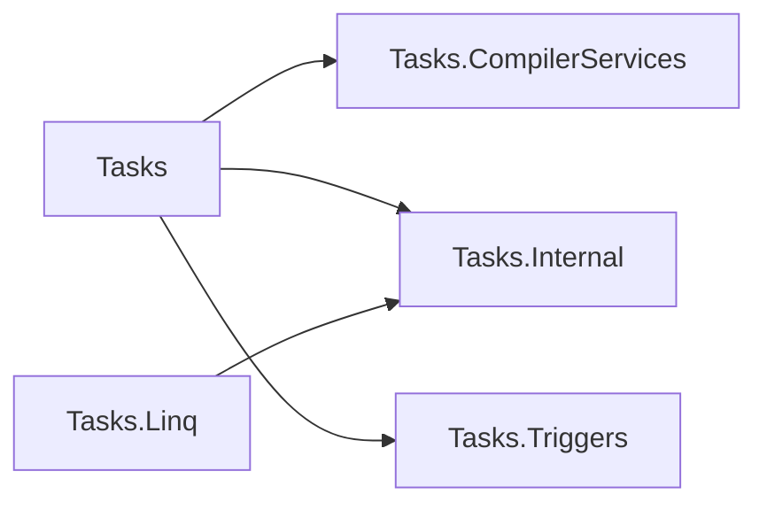

## 概要

[Cysharp/UniTask](https://github.com/Cysharp/UniTask) の内部実装のコードを読んだ際の読解メモです。

## ディレクトリ構成

全体のディレクト構成は以下のようになっています。

```sh
.
├── docs
│   └── api
└── src
    ├── UniTask
    │   ├── Assets
    │   │   ├── Editor
    │   │   ├── Plugins
    │   │   │   └── UniTask
    │   │   │       ├── Editor
    │   │   │       └── Runtime
    │   │   │           ├── CompilerServices
    │   │   │           ├── External
    │   │   │           │   ├── Addressables
    │   │   │           │   ├── DOTween
    │   │   │           │   └── TextMeshPro
    │   │   │           ├── Internal
    │   │   │           ├── Linq
    │   │   │           │   └── UnityExtensions
    │   │   │           └── Triggers
    │   │   ├── RuntimeUnitTestToolkit
    │   │   │   └── Editor
    │   │   ├── Scenes
    │   │   ├── StreamingAssets
    │   │   ├── TempAsm
    │   │   └── Tests
    │   │       ├── Editor
    │   │       └── Resources
    │   ├── ProjectSettings
    │   └── UserSettings
    ├── UniTask.Analyzer
    │   └── Properties
    ├── UniTask.NetCore
    │   └── NetCore
    ├── UniTask.NetCoreSandbox
    └── UniTask.NetCoreTests
        └── Linq

```

UniTask のパッケージ本体は [src/UniTask/Assets/Plugins/UniTask/](https://github.com/Cysharp/UniTask/tree/master/src/UniTask/Assets/Plugins/UniTask) に存在しており、パッケージ本体のみのディレクトリ構成は以下のようになります。

```sh
.
├── Editor
└── Runtime
    ├── CompilerServices
    ├── External
    │   ├── Addressables
    │   ├── DOTween
    │   └── TextMeshPro
    ├── Internal
    ├── Linq
    │   └── UnityExtensions
    └── Triggers
```

本記事ではこのディレクトリにのみ注目し、コードを読解していきます。

## 各 namespace 間の依存関係

登場する namespace は実質的には以下の 5 つです[^1]。

- Cysharp.Threading.Tasks
- Cysharp.Threading.Tasks.CompilerServices
- Cysharp.Threading.Tasks.Internal
- Cysharp.Threading.Tasks.Linq
- Cysharp.Threading.Tasks.Triggers

これらの namespace の依存関係を示した図が以下です。(Cysharp.Threading. の部分は省略しています)



[^1]: 厳密には AsyncMethodBuilderAttribute というクラスのみ System.Runtime.CompilerServices という namepspace に属していますが説明からは省いています。

## クラス図

## エントリーポイント

[PlayerLoopHelper](https://github.com/Cysharp/UniTask/blob/3121903fa3f35daba980a9c602a0fc6aff5f1eea/src/UniTask/Assets/Plugins/UniTask/Runtime/PlayerLoopHelper.cs#L179) という static クラスに定義されている [Init()](https://github.com/Cysharp/UniTask/blob/3121903fa3f35daba980a9c602a0fc6aff5f1eea/src/UniTask/Assets/Plugins/UniTask/Runtime/PlayerLoopHelper.cs#L293) メソッドに RuntimeInitializeOnLoadMethod attribute が付与されています。

そのため PlayerLoopHelper.Init() がプロセス起動直後に実行される、いわゆるエントリーポイントとなります。

### PlayerLoopHelper.Init()

PlayerLoopHelper.Init() について重要な部分のみ抜粋すると大まかに以下のような処理になっています。

```cs
static void Init()
{
    // 現在の UnitySynchronizationContext を取得
    unitySynchronizationContext = SynchronizationContext.Current;

    // メインスレッド ID を取得
    mainThreadId = Thread.CurrentThread.ManagedThreadId;

    // 現在の PlayerLoop を取得
    var playerLoop = PlayerLoop.GetCurrentPlayerLoop();

    Initialize(ref playerLoop);
}
```

PlayerLoop については以下の記事で詳しく説明されています。
- https://docs.unity3d.com/ja/2020.3/ScriptReference/LowLevel.PlayerLoop.html
- https://tsubakit1.hateblo.jp/entry/2018/04/17/233000
- https://www.hanachiru-blog.com/entry/2021/08/23/120000

```cs
public static void Initialize(ref PlayerLoopSystem playerLoop, InjectPlayerLoopTimings injectTimings = InjectPlayerLoopTimings.All)
{
    yielders = new ContinuationQueue[16];
    runners = new PlayerLoopRunner[16];

    var copyList = playerLoop.subSystemList.ToArray();

    // Initialization
    InsertLoop(copyList, injectTimings, typeof(PlayerLoopType.Initialization),
        InjectPlayerLoopTimings.Initialization, 0, true,
        typeof(UniTaskLoopRunners.UniTaskLoopRunnerYieldInitialization), typeof(UniTaskLoopRunners.UniTaskLoopRunnerInitialization), PlayerLoopTiming.Initialization);

    InsertLoop(copyList, injectTimings, typeof(PlayerLoopType.Initialization),
        InjectPlayerLoopTimings.LastInitialization, 1, false,
        typeof(UniTaskLoopRunners.UniTaskLoopRunnerLastYieldInitialization), typeof(UniTaskLoopRunners.UniTaskLoopRunnerLastInitialization), PlayerLoopTiming.LastInitialization);

    // EarlyUpdate
    InsertLoop(copyList, injectTimings, typeof(PlayerLoopType.EarlyUpdate),
        InjectPlayerLoopTimings.EarlyUpdate, 2, true,
        typeof(UniTaskLoopRunners.UniTaskLoopRunnerYieldEarlyUpdate), typeof(UniTaskLoopRunners.UniTaskLoopRunnerEarlyUpdate), PlayerLoopTiming.EarlyUpdate);

    InsertLoop(copyList, injectTimings, typeof(PlayerLoopType.EarlyUpdate),
        InjectPlayerLoopTimings.LastEarlyUpdate, 3, false,
        typeof(UniTaskLoopRunners.UniTaskLoopRunnerLastYieldEarlyUpdate), typeof(UniTaskLoopRunners.UniTaskLoopRunnerLastEarlyUpdate), PlayerLoopTiming.LastEarlyUpdate);

    // FixedUpdate
    InsertLoop(copyList, injectTimings, typeof(PlayerLoopType.FixedUpdate),
        InjectPlayerLoopTimings.FixedUpdate, 4, true,
        typeof(UniTaskLoopRunners.UniTaskLoopRunnerYieldFixedUpdate), typeof(UniTaskLoopRunners.UniTaskLoopRunnerFixedUpdate), PlayerLoopTiming.FixedUpdate);

    InsertLoop(copyList, injectTimings, typeof(PlayerLoopType.FixedUpdate),
        InjectPlayerLoopTimings.LastFixedUpdate, 5, false,
        typeof(UniTaskLoopRunners.UniTaskLoopRunnerLastYieldFixedUpdate), typeof(UniTaskLoopRunners.UniTaskLoopRunnerLastFixedUpdate), PlayerLoopTiming.LastFixedUpdate);

    // PreUpdate
    InsertLoop(copyList, injectTimings, typeof(PlayerLoopType.PreUpdate),
        InjectPlayerLoopTimings.PreUpdate, 6, true,
        typeof(UniTaskLoopRunners.UniTaskLoopRunnerYieldPreUpdate), typeof(UniTaskLoopRunners.UniTaskLoopRunnerPreUpdate), PlayerLoopTiming.PreUpdate);

    InsertLoop(copyList, injectTimings, typeof(PlayerLoopType.PreUpdate),
        InjectPlayerLoopTimings.LastPreUpdate, 7, false,
        typeof(UniTaskLoopRunners.UniTaskLoopRunnerLastYieldPreUpdate), typeof(UniTaskLoopRunners.UniTaskLoopRunnerLastPreUpdate), PlayerLoopTiming.LastPreUpdate);

    // Update
    InsertLoop(copyList, injectTimings, typeof(PlayerLoopType.Update),
        InjectPlayerLoopTimings.Update, 8, true,
        typeof(UniTaskLoopRunners.UniTaskLoopRunnerYieldUpdate), typeof(UniTaskLoopRunners.UniTaskLoopRunnerUpdate), PlayerLoopTiming.Update);

    InsertLoop(copyList, injectTimings, typeof(PlayerLoopType.Update),
        InjectPlayerLoopTimings.LastUpdate, 9, false,
        typeof(UniTaskLoopRunners.UniTaskLoopRunnerLastYieldUpdate), typeof(UniTaskLoopRunners.UniTaskLoopRunnerLastUpdate), PlayerLoopTiming.LastUpdate);

    // PreLateUpdate
    InsertLoop(copyList, injectTimings, typeof(PlayerLoopType.PreLateUpdate),
        InjectPlayerLoopTimings.PreLateUpdate, 10, true,
        typeof(UniTaskLoopRunners.UniTaskLoopRunnerYieldPreLateUpdate), typeof(UniTaskLoopRunners.UniTaskLoopRunnerPreLateUpdate), PlayerLoopTiming.PreLateUpdate);

    InsertLoop(copyList, injectTimings, typeof(PlayerLoopType.PreLateUpdate),
        InjectPlayerLoopTimings.LastPreLateUpdate, 11, false,
        typeof(UniTaskLoopRunners.UniTaskLoopRunnerLastYieldPreLateUpdate), typeof(UniTaskLoopRunners.UniTaskLoopRunnerLastPreLateUpdate), PlayerLoopTiming.LastPreLateUpdate);

    // PostLateUpdate
    InsertLoop(copyList, injectTimings, typeof(PlayerLoopType.PostLateUpdate),
        InjectPlayerLoopTimings.PostLateUpdate, 12, true,
        typeof(UniTaskLoopRunners.UniTaskLoopRunnerYieldPostLateUpdate), typeof(UniTaskLoopRunners.UniTaskLoopRunnerPostLateUpdate), PlayerLoopTiming.PostLateUpdate);

    InsertLoop(copyList, injectTimings, typeof(PlayerLoopType.PostLateUpdate),
        InjectPlayerLoopTimings.LastPostLateUpdate, 13, false,
        typeof(UniTaskLoopRunners.UniTaskLoopRunnerLastYieldPostLateUpdate), typeof(UniTaskLoopRunners.UniTaskLoopRunnerLastPostLateUpdate), PlayerLoopTiming.LastPostLateUpdate);

    // TimeUpdate
    InsertLoop(copyList, injectTimings, typeof(PlayerLoopType.TimeUpdate),
        InjectPlayerLoopTimings.TimeUpdate, 14, true,
        typeof(UniTaskLoopRunners.UniTaskLoopRunnerYieldTimeUpdate), typeof(UniTaskLoopRunners.UniTaskLoopRunnerTimeUpdate), PlayerLoopTiming.TimeUpdate);

    InsertLoop(copyList, injectTimings, typeof(PlayerLoopType.TimeUpdate),
        InjectPlayerLoopTimings.LastTimeUpdate, 15, false,
        typeof(UniTaskLoopRunners.UniTaskLoopRunnerLastYieldTimeUpdate), typeof(UniTaskLoopRunners.UniTaskLoopRunnerLastTimeUpdate), PlayerLoopTiming.LastTimeUpdate);

    // Insert UniTaskSynchronizationContext to Update loop
    var i = FindLoopSystemIndex(copyList, typeof(PlayerLoopType.Update));
    copyList[i].subSystemList = InsertUniTaskSynchronizationContext(copyList[i]);

    playerLoop.subSystemList = copyList;
    PlayerLoop.SetPlayerLoop(playerLoop);
}
```

## 参考文献

- [UniTaskを使った話](https://hackerslab.aktsk.jp/2019/12/05/124250)

## まとめ
