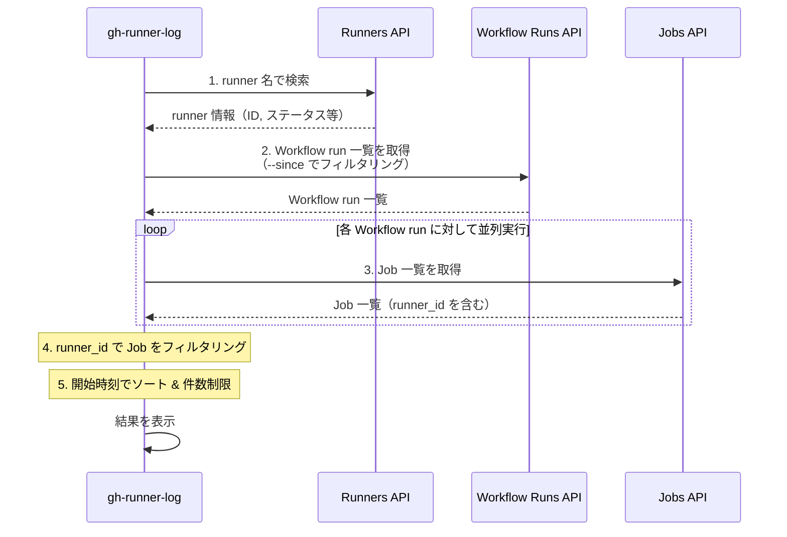
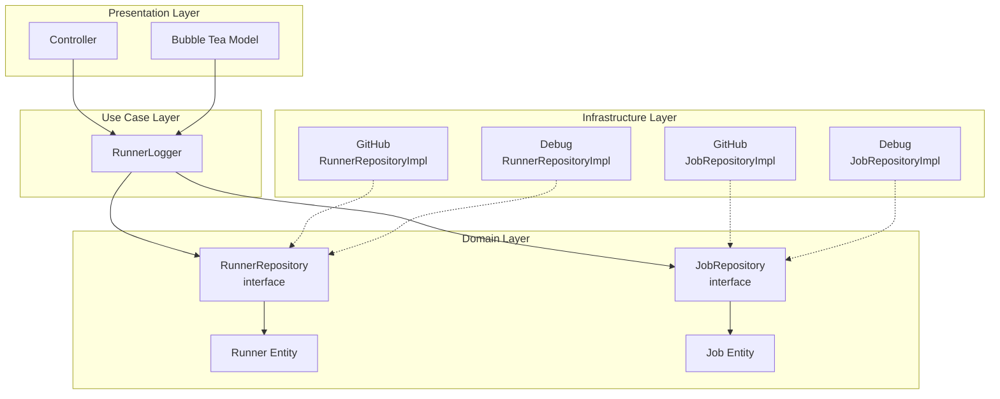

## はじめに

GitHub Actions の Self-hosted runner を運用していると、「この runner で最近どんな Job が実行されたんだろう？」「特定の runner で Job が失敗していないか確認したい」といった場面があるかと思います。

しかし、GitHub の UI では特定の runner に対する Job 実行履歴を簡単に確認する方法がありません。Workflow の実行履歴は見れても、それがどの runner で実行されたかを一覧で確認するのは面倒です。

そこで、Self-hosted runner の Job 実行履歴をターミナルから簡単に確認できる GitHub CLI 拡張「**gh-runner-log**」を作成しました。

https://github.com/VeyronSakai/gh-runner-log

## 機能

gh-runner-log は以下の機能を提供します。

- 📜 指定した Self-hosted runner の Job 実行履歴を表示
- 📊 Workflow 名、ステータス、結論、実行時間などの詳細を表示
- ⌨️ キーボードナビゲーション対応のインタラクティブ UI
- 🌐 Enter キーで Job の実行ページをブラウザで開く

## インストール

GitHub CLI がインストールされている環境で、以下のコマンドを実行するだけでインストールできます。

```bash
gh extension install VeyronSakai/gh-runner-log
```

## 使い方

### 基本的な使い方

カレントリポジトリに紐づく runner の Job 履歴を表示する場合：

```bash
gh runner-log my-runner-name
```

### 特定のリポジトリの runner を指定

```bash
gh runner-log my-runner-name --repo owner/repo
```

### Organization の runner を指定

```bash
gh runner-log my-runner-name --org organization-name
```

### 表示件数を指定

```bash
gh runner-log my-runner-name --max-count 10
```

### 時間範囲でフィルタリング

```bash
# 過去7日間の Job を表示
gh runner-log my-runner-name --since 7d

# 過去2週間の Job を表示
gh runner-log my-runner-name --since 2w

# 特定の日付以降の Job を表示
gh runner-log my-runner-name --since 2025-11-01
```

## 出力例

コマンドを実行すると、以下のようなインタラクティブなテーブル形式で結果が表示されます。

```
Runner: my-runner
Status: online
OS: linux
Labels: self-hosted, linux, x64

┌───────────────┬──────────────────────┬───────────┬────────────┬──────────────────────────────┬──────────┐
│ Workflow      │ Job                  │ Status    │ Conclusion │ Started At                   │ Duration │
├───────────────┼──────────────────────┼───────────┼────────────┼──────────────────────────────┼──────────┤
│ CI Pipeline   │ Build                │ completed │ success    │ 2025-11-15 10:30:00 EST      │ 5m 23s   │
│ Build and Test│ Test                 │ completed │ success    │ 2025-11-15 09:15:00 EST      │ 12m 45s  │
│ Deploy Prod   │ Deploy               │ completed │ success    │ 2025-11-15 08:00:00 EST      │ 3m 12s   │
│ Unit Tests    │ Unit Test            │ completed │ failure    │ 2025-11-15 07:45:00 EST      │ 2m 8s    │
│ Linting       │ Lint                 │ completed │ success    │ 2025-11-15 07:30:00 EST      │ 1m 5s    │
└───────────────┴──────────────────────┴───────────┴────────────┴──────────────────────────────┴──────────┘

↑/↓ or j/k: Navigate • Enter: Open in browser • q or Ctrl+C: Quit
```

runner の基本情報（名前、ステータス、OS、ラベル）と、その runner で実行された Job の一覧が表示されます。

## インタラクティブ操作

表示された Job 一覧は、以下のキーボード操作が可能です。

| キー | 操作 |
|------|------|
| `↑/↓` または `j/k` | Job の選択を移動 |
| `Enter` | 選択した Job の実行ページをブラウザで開く |
| `q` または `Ctrl+C` | 終了 |

気になる Job があれば、Enter キーを押すだけですぐにブラウザでログを確認できます。

## コマンドラインオプション

| オプション | 説明 |
|------------|------|
| `<runner-name>` | Self-hosted runner の名前（必須） |
| `--repo` | 特定のリポジトリを指定（形式: owner/repo） |
| `--org` | Organization を指定 |
| `-n, --max-count` | 表示する Job の最大数（デフォルト: 20） |
| `--since` | 指定した時間以降の Job を表示（デフォルト: 24h） |

`--since` オプションでは以下の形式がサポートされています：

- Duration 形式: `24h`、`2d`、`1w`（時間、日、週）
- 日付形式: `2025-11-17`（YYYY-MM-DD）
- RFC3339 形式: `2025-11-17T10:00:00Z`

## ユースケース

### 1. runner の稼働状況の確認

特定の runner がどれくらいの頻度で使用されているか、どんな Job を実行しているかを確認できます。

### 2. 障害調査

「この runner で最近失敗した Job はないか」を素早く確認できます。Conclusion カラムで `failure` となっている Job を見つけ、Enter キーで詳細を確認できます。

### 3. パフォーマンス分析

Duration カラムで Job の実行時間を確認し、特定の runner でのビルド時間の傾向を把握できます。

## 内部実装

gh-runner-log がどのように GitHub API を利用して情報を取得しているかを解説します。

### 使用している GitHub API

このツールは主に以下の 3 つの GitHub REST API を使用しています。

| API | エンドポイント | 取得する情報 |
|-----|---------------|-------------|
| List self-hosted runners | `GET /repos/{owner}/{repo}/actions/runners` または `GET /orgs/{org}/actions/runners` | runner の ID、名前、ステータス、OS、ラベル |
| List workflow runs | `GET /repos/{owner}/{repo}/actions/runs` または `GET /orgs/{org}/actions/runs` | Workflow run の一覧（ID、名前、ステータス、作成日時など） |
| List jobs for a workflow run | `GET /repos/{owner}/{repo}/actions/runs/{run_id}/jobs` | 各 Workflow run に含まれる Job の詳細（runner_id を含む） |

### データ取得の流れ



### なぜ複数の API を組み合わせる必要があるのか

GitHub API には「特定の runner で実行された Job の一覧を取得する」エンドポイントが存在しません。そのため、以下の手順でデータを突き合わせる必要があります。

1. **runner 情報の取得**: まず runner 名から runner ID を特定します
2. **Workflow run の取得**: 指定期間内の Workflow run を一覧取得します（`--since` オプションで `created` パラメータを指定）
3. **Job 情報の取得**: 各 Workflow run に対して Job 一覧を取得します。Job のレスポンスには `runner_id` フィールドが含まれています
4. **フィルタリング**: 取得した Job の中から、目的の runner ID に一致するものだけを抽出します

### アーキテクチャ



クリーンアーキテクチャに基づいた設計になっており、GitHub API の実装詳細はインフラストラクチャ層に隠蔽されています。`--debug` オプションを使用すると、GitHub API を呼び出さずにローカルの JSON ファイルからデータを読み込む実装に切り替わります。これにより、API を叩かずにツールの動作を確認できます。

### パフォーマンスの工夫

Workflow run ごとに Job を取得する処理は、並列で実行されます。これにより、多数の Workflow run がある場合でも効率的にデータを取得できます。

```go
// Fetch jobs for each run in parallel
results := make(chan result, len(runs.WorkflowRuns))

for _, run := range runs.WorkflowRuns {
    go func(r workflowRun) {
        jobs, err := j.getJobsForRun(r)
        results <- result{jobs: jobs, err: err}
    }(run)
}
```

## おわりに

gh-runner-log を使えば、Self-hosted runner の Job 実行履歴をターミナルから簡単に確認できます。Self-hosted runner を運用している方は、ぜひ試してみてください。

バグ報告や機能要望は、[GitHub リポジトリの Issues](https://github.com/VeyronSakai/gh-runner-log/issues) までお願いします。
