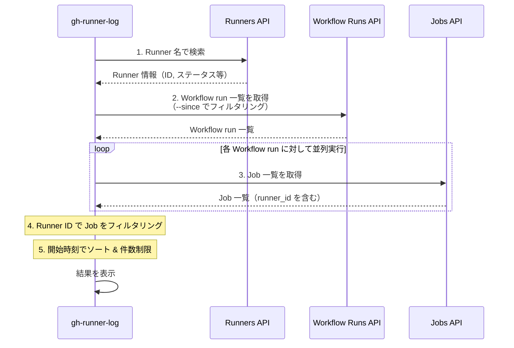
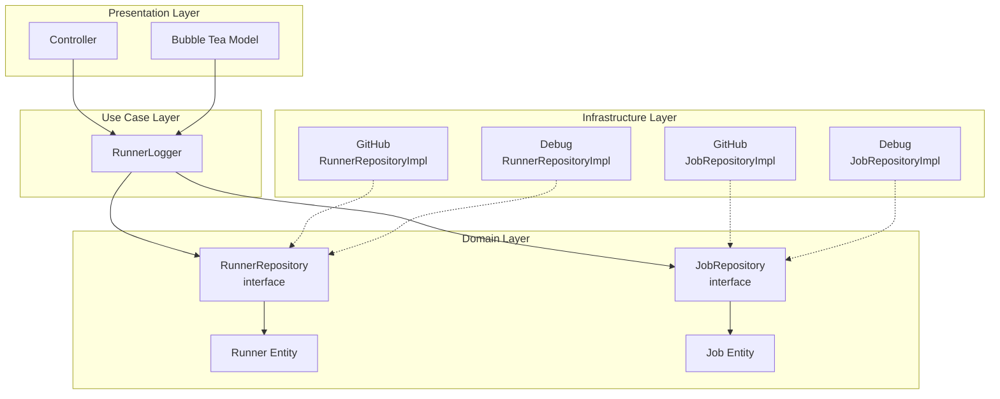

## はじめに

GitHub Actions の Self-hosted Runner を運用していると、「この Runner で最近どんな Job が実行されたんだろう？」「特定の Runner で過去に Job が失敗していないか確認したい」といった場面があるかと思います。

しかし、GitHub の UI では特定の Runner に対する Job 実行履歴を簡単に確認する方法がありません。Workflow の実行履歴は見れても、それがどの Runner で実行されたかを一覧で確認するのは面倒です。

そこで、Self-hosted Runner の Job 実行履歴をターミナルから簡単に確認できる GitHub CLI 拡張「**gh-runner-log**」を作成しました。

https://github.com/VeyronSakai/gh-runner-log

## GitHub CLI 拡張とは

GitHub CLI（`gh`）は、GitHub が公式に提供しているコマンドラインツールです。Issue や Pull Request の操作、リポジトリの管理など、GitHub の様々な機能をターミナルから利用できます。

https://cli.github.com/

GitHub CLI 拡張（gh extension）は、この `gh` コマンドに独自のサブコマンドを追加できる仕組みです。拡張機能は任意の言語で実装でき、`gh extension install` コマンドで簡単にインストールできます。

```bash
# 拡張機能のインストール
gh extension install owner/repo

# インストールすると gh のサブコマンドとして利用可能
gh <extension-name> [args]
```

今回作成した gh-runner-log も、この仕組みを利用しています。Go で実装しており、インストール後は `gh runner-log` コマンドとして利用できます。

## 機能

gh-runner-log は以下の機能を提供します。

- 📜 指定した Self-hosted Runner の Job 実行履歴を表示
- 📊 Workflow 名、ステータス、結論、実行時間などの詳細を表示
- ⌨️ キーボードナビゲーション対応のインタラクティブ UI
- 🌐 Enter キーで Job の実行ページをブラウザで開く

## インストール

GitHub CLI がインストールされている環境で、以下のコマンドを実行するだけでインストールできます。

```bash
gh extension install VeyronSakai/gh-runner-log
```

## 使い方

### 基本的な使い方

カレントリポジトリに紐づく Runner の Job 履歴を表示する場合：

```bash
gh runner-log my-runner-name
```

### 特定のリポジトリの Runner を指定

```bash
gh runner-log my-runner-name --repo owner/repo
```

### Organization の Runner を指定

```bash
gh runner-log my-runner-name --org organization-name
```

### 表示件数を指定

```bash
gh runner-log my-runner-name --max-count 10
```

### 時間範囲でフィルタリング

```bash
# 過去7日間の Job を表示
gh runner-log my-runner-name --since 7d

# 過去2週間の Job を表示
gh runner-log my-runner-name --since 2w

# 特定の日付以降の Job を表示
gh runner-log my-runner-name --since 2025-11-01
```

## 出力例

コマンドを実行すると、以下のようなインタラクティブなテーブル形式で結果が表示されます。

```
Runner: my-runner
Status: online
OS: linux
Labels: self-hosted, linux, x64

┌───────────────┬──────────────────────┬───────────┬────────────┬──────────────────────────────┬──────────┐
│ Workflow      │ Job                  │ Status    │ Conclusion │ Started At                   │ Duration │
├───────────────┼──────────────────────┼───────────┼────────────┼──────────────────────────────┼──────────┤
│ CI Pipeline   │ Build                │ completed │ success    │ 2025-11-15 10:30:00 EST      │ 5m 23s   │
│ Build and Test│ Test                 │ completed │ success    │ 2025-11-15 09:15:00 EST      │ 12m 45s  │
│ Deploy Prod   │ Deploy               │ completed │ success    │ 2025-11-15 08:00:00 EST      │ 3m 12s   │
│ Unit Tests    │ Unit Test            │ completed │ failure    │ 2025-11-15 07:45:00 EST      │ 2m 8s    │
│ Linting       │ Lint                 │ completed │ success    │ 2025-11-15 07:30:00 EST      │ 1m 5s    │
└───────────────┴──────────────────────┴───────────┴────────────┴──────────────────────────────┴──────────┘

↑/↓ or j/k: Navigate • Enter: Open in browser • q or Ctrl+C: Quit
```

Runner の基本情報（名前、ステータス、OS、ラベル）と、その Runner で実行された Job の一覧が表示されます。

## インタラクティブ操作

表示された Job 一覧は、以下のキーボード操作が可能です。

| キー                | 操作                                      |
| ------------------- | ----------------------------------------- |
| `↑/↓` または `j/k`  | Job の選択を移動                          |
| `Enter`             | 選択した Job の実行ページをブラウザで開く |
| `q` または `Ctrl+C` | 終了                                      |

気になる Job があれば、Enter キーを押すだけですぐにブラウザでログを確認できます。

## コマンドラインオプション

| オプション        | 説明                                             |
| ----------------- | ------------------------------------------------ |
| `<runner-name>`   | Self-hosted Runner の名前（必須）                |
| `--repo`          | 特定のリポジトリを指定（形式: owner/repo）       |
| `--org`           | Organization を指定                              |
| `-n, --max-count` | 表示する Job の最大数（デフォルト: 20）          |
| `--since`         | 指定した時間以降の Job を表示（デフォルト: 24h） |

`--since` オプションでは以下の形式がサポートされています：

- Duration 形式: `24h`、`2d`、`1w`（時間、日、週）
- 日付形式: `2025-11-17`（YYYY-MM-DD）
- RFC3339 形式: `2025-11-17T10:00:00Z`

## ユースケース

- **Runner の稼働状況の確認**
  - 特定の Runner がどれくらいの頻度で使用されているか、どんな Job を実行しているかを確認できます。
- **障害調査**
  - 「この Runner で最近失敗した Job はないか」を素早く確認できます。Conclusion カラムで `failure` となっている Job を見つけ、Enter キーで詳細を確認できます。
- **パフォーマンス分析**
  - Duration カラムで Job の実行時間を確認し、特定の Runner での Job の実行時間の傾向を把握できます。

## 内部実装

gh-runner-log がどのように GitHub API を利用して情報を取得しているかを解説します。

### 使用している GitHub API

このツールは主に以下の 3 つの GitHub REST API を使用しています。

| API                          | エンドポイント                                                                       | 取得する情報                                              |
| ---------------------------- | ------------------------------------------------------------------------------------ | --------------------------------------------------------- |
| List self-hosted runners     | `GET /repos/{owner}/{repo}/actions/runners` または `GET /orgs/{org}/actions/runners` | Runner の ID、名前、ステータス、OS、ラベル                |
| List workflow runs           | `GET /repos/{owner}/{repo}/actions/runs` または `GET /orgs/{org}/actions/runs`       | Workflow run の一覧（ID、名前、ステータス、作成日時など） |
| List jobs for a workflow run | `GET /repos/{owner}/{repo}/actions/runs/{run_id}/jobs`                               | 各 Workflow run に含まれる Job の詳細（runner_id を含む） |

### データ取得の流れ



### なぜ複数の API を組み合わせる必要があるのか

GitHub API には「特定の Runner で実行された Job の一覧を取得する」エンドポイントが存在しません。そのため、以下の手順でデータを突き合わせる必要があります。

1. **Runner 情報の取得**: まず Runner 名から Runner ID を特定します
2. **Workflow run の取得**: 指定期間内の Workflow run を一覧取得します（`--since` オプションで `created` パラメータを指定）
3. **Job 情報の取得**: 各 Workflow run に対して Job 一覧を取得します。Job のレスポンスには `runner_id` フィールドが含まれています
4. **フィルタリング**: 取得した Job の中から、目的の Runner ID に一致するものだけを抽出します

:::message alert
**API Rate Limit に関する注意**

このツールは内部で複数の API を呼び出すため、頻繁に実行したり `--since` オプションで過去に遡りすぎると、GitHub API の Rate Limit に達する可能性があります。

特に Workflow run の数が多い場合、各 run に対して Job 一覧を取得する API が呼び出されるため、API 呼び出し回数が増加します。Rate Limit に達した場合はしばらく時間をおいてから再実行してください。
:::

### アーキテクチャ



上記のような設計になっており、GitHub API の実装詳細はインフラストラクチャ層に隠蔽されています。`--debug` オプションを使用すると、GitHub API を呼び出さずにローカルの JSON ファイルからデータを読み込む実装に切り替わります。これにより、API を叩かずにツールの View の動作の確認を効率良く行うことができました。

### パフォーマンスの工夫

Workflow run ごとに Job を取得する処理は、並列で実行されます。これにより、多数の Workflow run がある場合でも効率的にデータを取得できます。

```go
// Fetch jobs for each run in parallel
results := make(chan result, len(runs.WorkflowRuns))

for _, run := range runs.WorkflowRuns {
    go func(r workflowRun) {
        jobs, err := j.getJobsForRun(r)
        results <- result{jobs: jobs, err: err}
    }(run)
}
```

## おまけ: gh-runner-monitor

Self-hosted Runner 関連でもう一つ、**gh-runner-monitor** というツールも作成しましたのでついでにおまけとして紹介させていただきます。

https://github.com/VeyronSakai/gh-runner-monitor

gh-runner-log が**過去の Job 履歴**を確認するツールなのに対し、gh-runner-monitor は**現在の Runner の状態**をリアルタイムで監視するツールです。

### 作成の動機

GitHub の Web UI には Runner の一覧ページがあり、各 Runner が Idle なのか Active なのか Offline なのか、といったステータスは確認できます。しかし、「どの Job がどのくらいの時間実行されているか」という情報は一覧ページからは確認できず、各 Runner をクリックして個別のページに遷移する必要がありました。

複数の Runner を運用していると、この確認作業が面倒になってきます。もっと簡単に全 Runnner の状態を常に監視したいと思い、このツールを作りました。

### 主な機能

- 🔄 Self-hosted Runner のリアルタイム監視
- 📊 Runner のステータス（Idle / Active / Offline）を色分け表示
- 💼 実行中の Job と経過時間を表示
- ⌨️ キーボードナビゲーション対応のインタラクティブ TUI

### インストール

```bash
gh extension install VeyronSakai/gh-runner-monitor
```

### 使い方

```bash
# カレントリポジトリの Runner を監視
gh runner-monitor

# 特定のリポジトリを指定
gh runner-monitor --repo owner/repo

# Organization を指定
gh runner-monitor --org organization-name

# 更新間隔を指定（デフォルト: 5秒）
gh runner-monitor --interval 10
```

:::message alert
**API Rate Limit に関する注意**

gh-runner-monitor は定期的に GitHub API を呼び出して Runner の状態を更新します。Self-hosted Runner の数が多い場合や、高頻度で Job が実行されている環境では、API の Rate Limit に達する可能性があります。

そのような環境では `--interval` オプションで更新間隔を 30 秒程度に設定することをおすすめします。

```bash
gh runner-monitor --interval 30
```
:::

## おわりに

gh-runner-log を使えば、Self-hosted Runner の Job 実行履歴をターミナルから簡単に確認できます。また、gh-runner-monitor と併用することで、Self-hosted Runner の「過去」と「現在」の両方を効率的に把握できます。Self-hosted Runner を運用している方は、ぜひ試してみてください。
