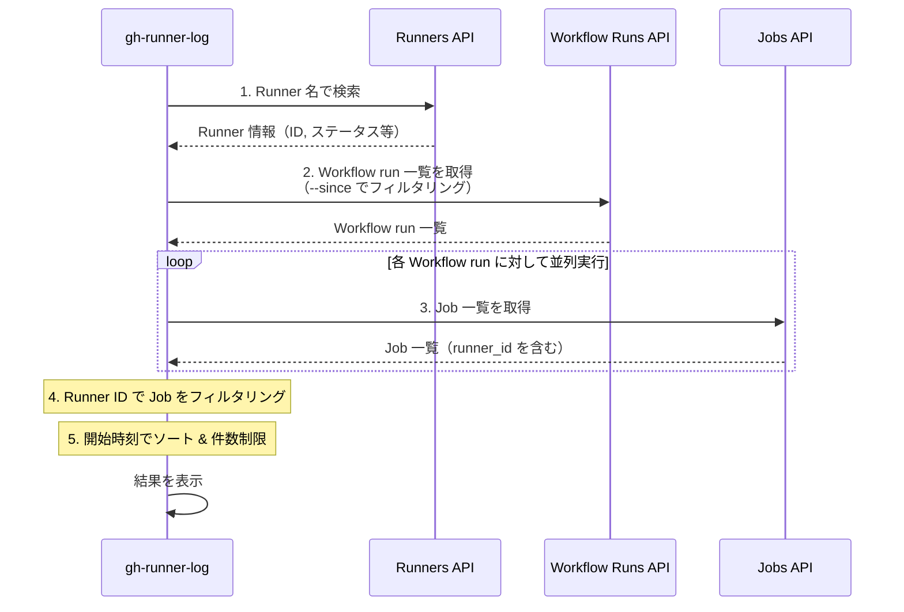

:::message
この記事は Akatsuki Games Advent Calendar 2025 の 19 日目の記事です。
:::

## はじめに

GitHub Actions の Self-hosted Runner を運用していると、「この Runner で最近どんな Job が実行されたんだろうか」「特定の Runner で過去に Job が失敗していないか確認したい」といった場面があります。

しかし、GitHub の UI では特定の Runner に対する Job 実行履歴を簡単に確認する方法がありません。Workflow の実行履歴は見られても、それがどの Runner で実行されたかを一覧で確認するのは面倒です。

そこで、特定の Self-hosted Runner に絞った Job 実行履歴をターミナルから簡単に確認できる GitHub CLI 拡張「**[gh-runner-log](https://github.com/VeyronSakai/gh-runner-log)**」を作成しました。

## GitHub CLI 拡張とは

[GitHub CLI](https://cli.github.com/)（`gh`）は、GitHub が公式に提供している CLI ツールです。Issue や Pull Request の操作、リポジトリの管理など、GitHub の様々な機能をターミナルから利用できます。

GitHub CLI 拡張（gh extension）は、この `gh` コマンドに独自のサブコマンドを追加できる仕組みです。実装したサブコマンドは `gh extension install` コマンドで簡単にインストールできます。

```bash
# 拡張機能のインストール
gh extension install owner/repo

# インストールすると gh のサブコマンドとして利用可能
gh <extension-name> [args]
```

今回作成した gh-runner-log もこの仕組みを利用しています。Go で実装しており、インストール後は `gh runner-log` コマンドとして利用できます。

## gh-runner-log とは

gh-runner-log は「指定した Self-hosted Runner に絞った Job 実行履歴を表示する機能」を提供します。

### インストール方法

GitHub CLI がインストールされている環境で、以下のコマンドを実行するだけでインストールできます。

```bash
gh extension install VeyronSakai/gh-runner-log
```

### 実行方法

カレントリポジトリに紐づく Runner の Job 履歴を表示する場合は以下のコマンドで実行できます。

```bash
gh runner-log <runner-name>
```

:::message

認証がお済みでない場合は事前に `gh auth login` などにより認証を済ませておく必要があります。

:::

### 出力例

実行すると、以下のようなテーブル形式で結果が表示されます。

```text
Runner: my-runner
Status: online
OS: linux
Labels: self-hosted, linux, x64

┌───────────────┬──────────────────────┬───────────┬────────────┬──────────────────────────────┬──────────┐
│ Workflow      │ Job                  │ Status    │ Conclusion │ Started At                   │ Duration │
├───────────────┼──────────────────────┼───────────┼────────────┼──────────────────────────────┼──────────┤
│ CI Pipeline   │ Build                │ completed │ success    │ 2025-11-15 10:30:00 EST      │ 5m 23s   │
│ Build and Test│ Test                 │ completed │ success    │ 2025-11-15 09:15:00 EST      │ 12m 45s  │
│ Deploy Prod   │ Deploy               │ completed │ success    │ 2025-11-15 08:00:00 EST      │ 3m 12s   │
│ Unit Tests    │ Unit Test            │ completed │ failure    │ 2025-11-15 07:45:00 EST      │ 2m 8s    │
│ Linting       │ Lint                 │ completed │ success    │ 2025-11-15 07:30:00 EST      │ 1m 5s    │
└───────────────┴──────────────────────┴───────────┴────────────┴──────────────────────────────┴──────────┘

↑/↓ or j/k: Navigate • Enter: Open in browser • q or Ctrl+C: Quit
```

### 操作方法

表示された Job 一覧は、以下のキーボード操作が可能です。

| キー                | 操作                                      |
| ------------------- | ----------------------------------------- |
| `↑/↓` または `j/k`  | Job の選択を移動                          |
| `Enter`             | 選択した Job の実行ページをブラウザで開く |
| `q` または `Ctrl+C` | 終了                                      |

気になる Job があれば、Enter キーを押すだけですぐにブラウザでログを確認できます。

## コマンドラインオプション

| オプション        | 説明                                             |
| ----------------- | ------------------------------------------------ |
| `<runner-name>`   | Self-hosted Runner の名前（必須）                |
| `--repo`          | 特定のリポジトリを指定（形式: owner/repo）       |
| `--org`           | Organization を指定                              |
| `-n, --max-count` | 表示する Job の最大数（デフォルト: 20）          |
| `--since`         | 指定した時間以降の Job を表示（デフォルト: 24h） |

`--since` オプションでは以下の形式がサポートされています。

- Duration 形式: `24h`、`2d`、`1w`（時間、日、週）
- 日付形式: `2025-11-17`（YYYY-MM-DD）
- RFC3339 形式: `2025-11-17T10:00:00Z`

## ユースケース

- Runner の稼働状況を確認できる（特定の Runner がどれくらいの頻度で使用されているか、どんな Job を実行しているか）。
- 障害調査に使える（Conclusion カラムで `failure` となっている Job を見つけ、Enter キーで詳細を確認できる）。
- パフォーマンス分析に使える（Duration カラムで Job の実行時間を確認し、特定の Runner での Job の実行時間の傾向を把握できる）。

## 内部実装

gh-runner-log の内部実装について軽く解説させていただきます。

### 使用している GitHub API

このツールは主に以下の 3 つの GitHub REST API を使用しています。

| API                          | エンドポイント                                                                       | 取得する情報                                              |
| ---------------------------- | ------------------------------------------------------------------------------------ | --------------------------------------------------------- |
| List self-hosted runners     | `GET /repos/{owner}/{repo}/actions/runners` または `GET /orgs/{org}/actions/runners` | Runner の ID、名前、ステータス、OS、ラベル                |
| List workflow runs           | `GET /repos/{owner}/{repo}/actions/runs`                                             | Workflow run の一覧（ID、名前、ステータス、作成日時など） |
| List jobs for a workflow run | `GET /repos/{owner}/{repo}/actions/runs/{run_id}/jobs`                               | 各 Workflow run に含まれる Job の詳細（runner_id を含む） |

### データ取得の流れ



### なぜ複数の API を組み合わせる必要があるのか

GitHub API には「特定の Runner で実行された Job の一覧を取得する」エンドポイントが存在しません。そのため、以下の手順でデータを突き合わせる必要があります。

1. **Runner 情報の取得**: まず Runner 名から Runner ID を特定する。
2. **Workflow run の取得**: 指定期間内の Workflow run を一覧取得する（`--since` オプションで `created` パラメータを指定）。
3. **Job 情報の取得**: 各 Workflow run に対して Job 一覧を取得する。Job のレスポンスには `runner_id` フィールドが含まれている。
4. **フィルタリング**: 取得した Job の中から、目的の Runner ID に一致するものだけを抽出する。

:::message alert
**API Rate Limit に関する注意**

このツールは内部で複数の API を呼び出すため、頻繁に実行したり `--since` オプションで過去に遡りすぎると、GitHub API の Rate Limit に達する可能性があります。

特に Workflow run の数が多い場合、各 run に対して Job 一覧を取得する API が呼び出されるため、API 呼び出し回数が増加します。Rate Limit に達した場合はしばらく時間をおいてから再実行してください。
:::

## おわりに

この記事では、GitHub の UI だけでは確認しづらい「特定の Self-hosted Runner で最近どんな Job が実行されていたか」を、ターミナルから素早く確認できる GitHub CLI 拡張 gh-runner-log を紹介しました。

Self-hosted Runner を運用していると、「この Runner で失敗が続いていないか」「最近この Runner が忙しすぎないか」「Job の実行時間が伸びていないか」など、ちょっとした確認を何度も行う場面があります。gh-runner-log を使えば、Runner ごとの Job 履歴を一覧で見ながら、障害調査やパフォーマンス分析の初動を短縮できます。

なお、内部では複数の GitHub API を呼び出しているため、頻繁に実行したり `--since` で過去に遡りすぎたりすると Rate Limit に達する可能性があります。必要に応じて期間や件数を絞って利用するのがおすすめです。

また、GitHub CLI 拡張として作られているので gh コマンドがインストール済みであれば簡単にインストールできます。
Self-hosted Runner を運用している方は、ぜひ試してみてください。フィードバックや不具合報告は [Issues](https://github.com/VeyronSakai/gh-runner-log/issues) までお願いします。
