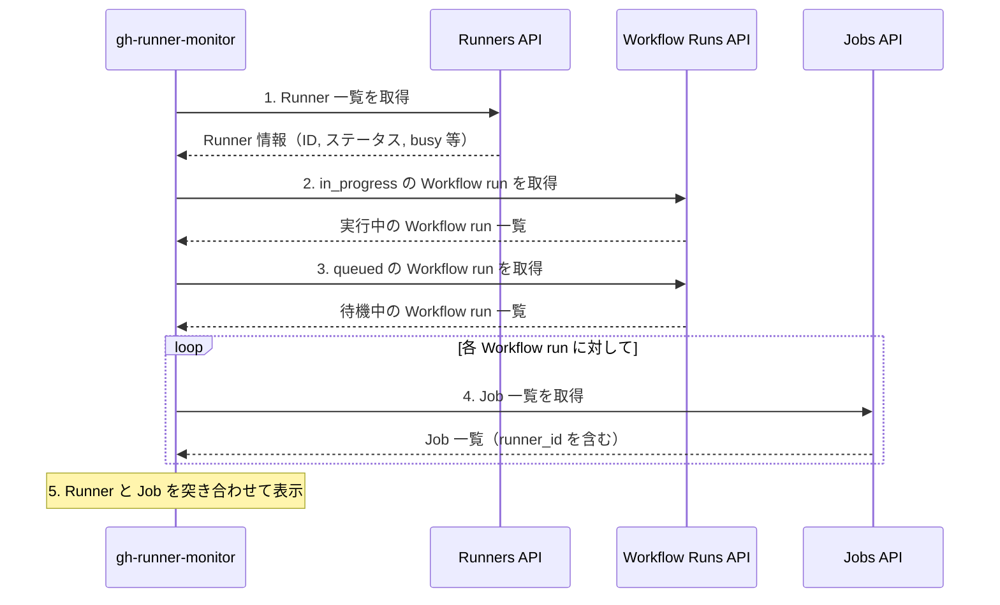

## はじめに

以前、[特定の Self-hosted Runner に絞って Job の実行履歴を確認できる GitHub CLI 拡張を作った](https://zenn.dev/veryon_sakai/articles/6bc9f34595ad01)という記事で、[gh-runner-log](https://github.com/VeyronSakai/gh-runner-log) を紹介しました。gh-runner-log は「特定の Runner で過去にどんな Job が実行されたか」を確認するツールです。

一方で、Self-hosted Runner を運用していると「今、各 Runner がどんな状態にあるか」をリアルタイムで把握したい場面があります。どの Runner が稼働中で、どの Runner がアイドル状態なのか。オフラインになっている Runner はないか。こうした情報をサッと確認したいときがあります。

そこで、Self-hosted Runner の稼働状況をリアルタイムで監視できる GitHub CLI 拡張「**[gh-runner-monitor](https://github.com/VeyronSakai/gh-runner-monitor)**」を作成しました。

## gh-runner-monitor とは

gh-runner-monitor は、GitHub Actions の Self-hosted Runner の稼働状況をターミナルからリアルタイムで監視できるツールです。TUI（Terminal User Interface）を採用しており、インタラクティブに操作できます。


主な機能は以下のとおりです。

- 🔄 Runner のステータス（Idle/Active/Offline）をリアルタイムで監視
- 📊 ステータスを色分けして視覚的にわかりやすく表示
- 💼 実行中の Job と経過時間を表示
- ⌨️ キーボード操作でのナビゲーション

## インストール方法

GitHub CLI がインストールされている環境で、以下のコマンドを実行するだけでインストールできます。

```bash
gh extension install VeyronSakai/gh-runner-monitor
```

:::message
認証がお済みでない場合は、事前に `gh auth login` で認証を済ませておく必要があります。
:::

## 使い方

### 基本的な実行方法

カレントディレクトリのリポジトリに紐づく Runner を監視する場合は、以下のコマンドを実行します。

```bash
gh runner-monitor
```

### 特定のリポジトリを指定する

`--repo` オプションで、任意のリポジトリの Runner を監視できます。

```bash
gh runner-monitor --repo owner/repo
```

### 更新間隔を変更する

`--interval` オプションで、自動更新の間隔を秒単位で指定できます。デフォルトは 5 秒です。

```bash
# 10 秒ごとに更新
gh runner-monitor --interval 10
```

## 表示内容

実行すると、Runner の一覧がテーブル形式で表示されます。各 Runner について、以下の情報が確認できます。

- Runner 名
- ステータス（Idle/Active/Offline）
- OS
- ラベル
- 実行中の Job 名と経過時間（Active の場合）

### ステータスの色分け

Runner のステータスは、以下のように色分けされて表示されます。

| 色 | ステータス | 意味 |
| --- | --- | --- |
| 🟢 緑 | Idle | オンラインで待機中 |
| 🟠 オレンジ | Active | Job を実行中 |
| ⚫ グレー | Offline | オフライン |

ステータスが色分けされているため、複数の Runner があっても一目で状態を把握できます。

## キーボードショートカット

gh-runner-monitor は TUI を採用しており、以下のキーボード操作が可能です。

| キー | 操作 |
| --- | --- |
| `↑/↓` または `j/k` | Runner 間の移動 |
| `r` | 手動で更新 |
| `q` または `Ctrl+C` | 終了 |

## ユースケース

gh-runner-monitor は、以下のような場面で役立ちます。

- **稼働状況の把握**: 複数の Runner がどのような状態にあるかを一目で確認したいとき
- **障害検知**: Runner がオフラインになっていないか素早くチェックしたいとき
- **負荷の確認**: どの Runner が忙しく、どの Runner がアイドル状態かを把握したいとき
- **実行時間の監視**: Job の実行時間が想定より長くなっていないか確認したいとき

## 内部実装

gh-runner-monitor の内部実装について簡単に解説します。

### 使用している GitHub API

このツールは主に以下の GitHub REST API を使用しています。

| API | エンドポイント | 取得する情報 |
| --- | --- | --- |
| List self-hosted runners | `GET /repos/{owner}/{repo}/actions/runners` | Runner の ID、名前、ステータス、OS、ラベル |
| List workflow runs | `GET /repos/{owner}/{repo}/actions/runs?status={status}` | 実行中（in_progress）および待機中（queued）の Workflow run 一覧 |
| List jobs for a workflow run | `GET /repos/{owner}/{repo}/actions/runs/{run_id}/jobs` | 各 Workflow run に含まれる Job の詳細 |

### データ取得の流れ



1. **Runner 一覧の取得**: List self-hosted runners API で、リポジトリに紐づくすべての Runner を取得する。各 Runner の `status`（online/offline）と `busy`（true/false）から、Idle/Active/Offline を判定する。
2. **実行中の Job の取得**: List workflow runs API で、`status=in_progress` と `status=queued` の Workflow run を取得する。
3. **Job の詳細取得**: 各 Workflow run に対して List jobs API を呼び出し、実行中の Job と担当 Runner を特定する。
4. **データの統合**: Runner 情報と Job 情報を突き合わせ、どの Runner がどの Job を実行中かを表示する。

:::message alert
**API Rate Limit に関する注意**

gh-runner-monitor は定期的に GitHub API を呼び出すため、更新間隔が短いとレートリミットに達する可能性があります。レートリミットに達してしまう場合は、`--interval` オプションで更新間隔を長めに設定してください。

```bash
# 30 秒ごとに更新（デフォルトは 5 秒）
gh runner-monitor --interval 30
```

:::

## gh-runner-log との使い分け

以前紹介した [gh-runner-log](https://github.com/VeyronSakai/gh-runner-log) と [gh-runner-monitor](https://github.com/VeyronSakai/gh-runner-monitor) は、それぞれ異なる用途に適しています。

| ツール | 用途 | 確認できる情報 |
| --- | --- | --- |
| gh-runner-log | 事後分析 | 特定 Runner の**過去**の Job 履歴 |
| gh-runner-monitor | リアルタイム監視 | 複数 Runner の**現在**の稼働状況 |

「過去に何が起きたか」を調べるなら gh-runner-log、「今どうなっているか」を知りたいなら gh-runner-monitor を使います。両方を組み合わせることで、Self-hosted Runner をより効率的に運用できます。

## まとめ

この記事では、Self-hosted Runner の稼働状況をリアルタイムで監視できる GitHub CLI 拡張 gh-runner-monitor を紹介しました。

- TUI で Runner のステータスを直感的に確認できる
- ステータスが色分けされるため、一目で状態を把握できる
- [gh-runner-log](https://github.com/VeyronSakai/gh-runner-log) と組み合わせることで、過去と現在の両方を把握できる

Self-hosted Runner を運用している方は、ぜひ試してみてください。フィードバックや不具合報告は [Issues](https://github.com/VeyronSakai/gh-runner-monitor/issues) までお願いします。

## 参考

- [VeyronSakai/gh-runner-monitor](https://github.com/VeyronSakai/gh-runner-monitor)
- [特定の Self-hosted Runner に絞って Job の実行履歴を確認できる GitHub CLI 拡張を作った](https://zenn.dev/veryon_sakai/articles/6bc9f34595ad01)
- [GitHub CLI](https://cli.github.com/)
